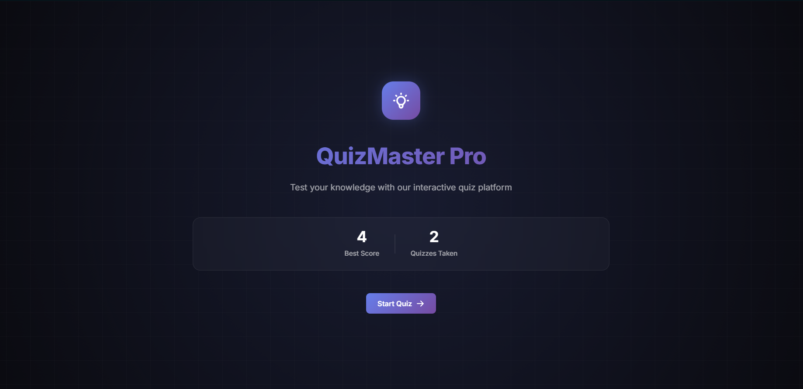
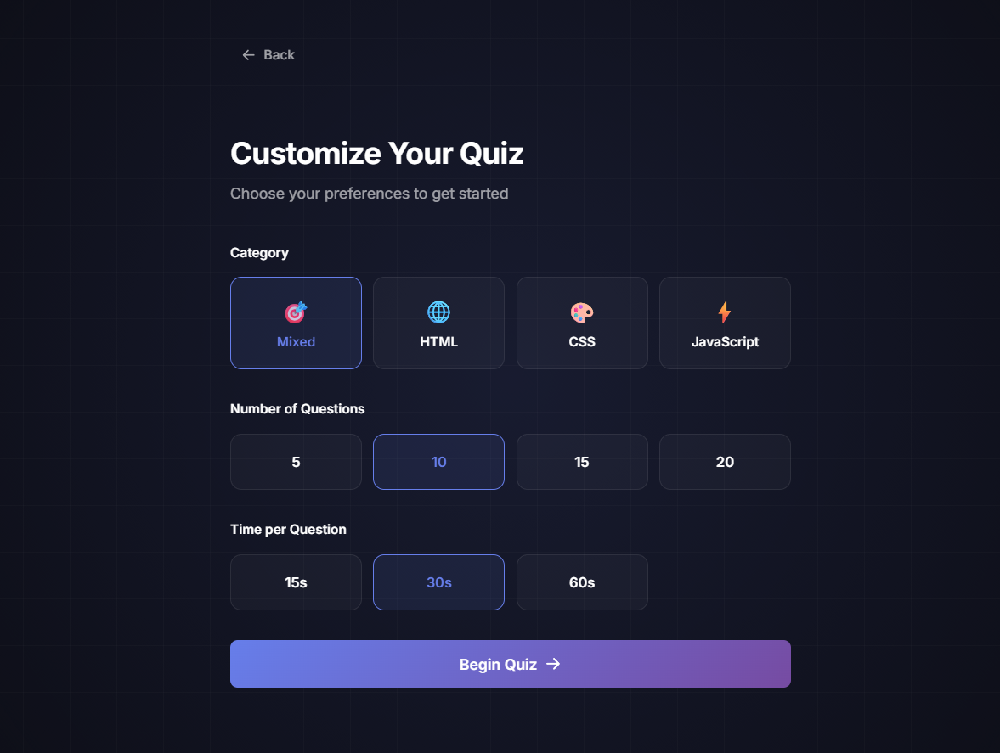
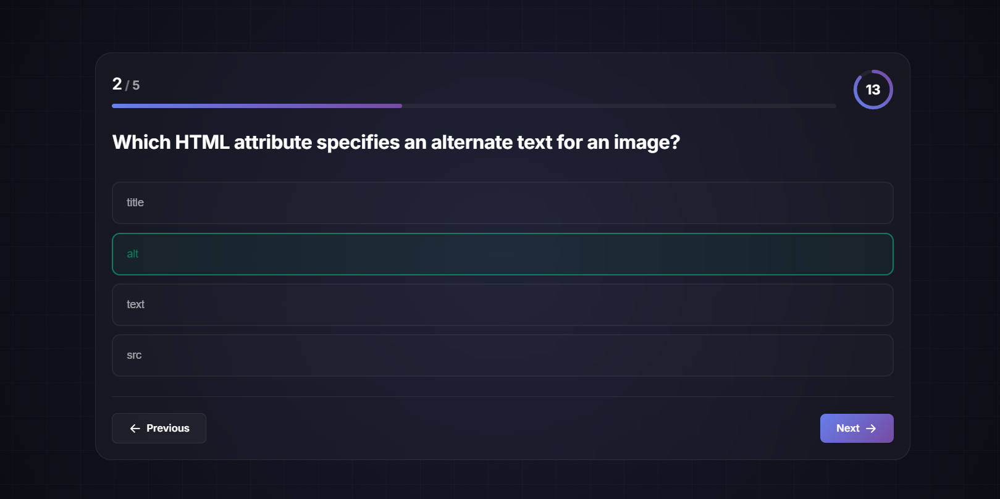
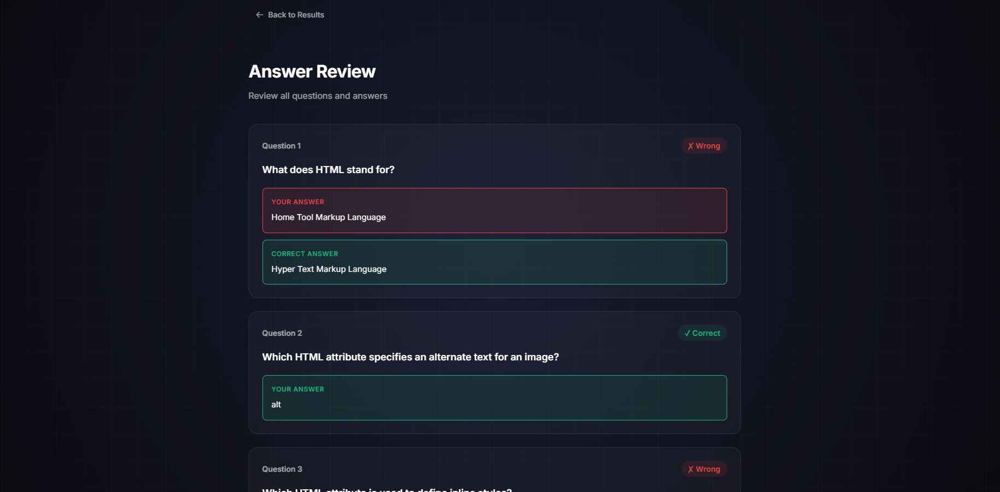

# QuizMaster Pro

QuizMaster Pro is a responsive quiz application built using HTML, CSS, and JavaScript. It presents one question at a time, tracks the user's score, and displays a detailed result summary after the quiz. The project was created to practice frontend development concepts while focusing on clean design, responsive layouts, and interactive user experiences.

---

## Features

- Multiple-choice quiz
- One question displayed at a time
- Next and Submit navigation
- Circular countdown timer
- Progress indicator
- Correct and incorrect answer tracking
- Score calculation
- Result summary
- Answer review
- Quiz customization
- Responsive design
- Smooth animations
- Local storage for high score

---

## Built With

- HTML5
- CSS3
- JavaScript 

---

## Folder Structure

```
quizmaster-pro/
│
├── index.html
├── css/
│   └── style.css
├── js/
│   └── script.js
├── assets/
└── screenshots/
```

---

## Screenshots

### Home


### Quiz Setup


### Quiz


### Result


### Answer Review

## Getting Started

Clone the repository

```bash
https://github.com/Vaibhavigund/quizmaster-pro
```

Open the project folder and launch `index.html` in your browser.

No additional installation is required.

---

## Future Improvements

- Additional quiz categories
- More question sets
- Difficulty-based scoring
- Improved accessibility
- Better performance optimizations

---

## Author

**Vaibhavi Gund**
